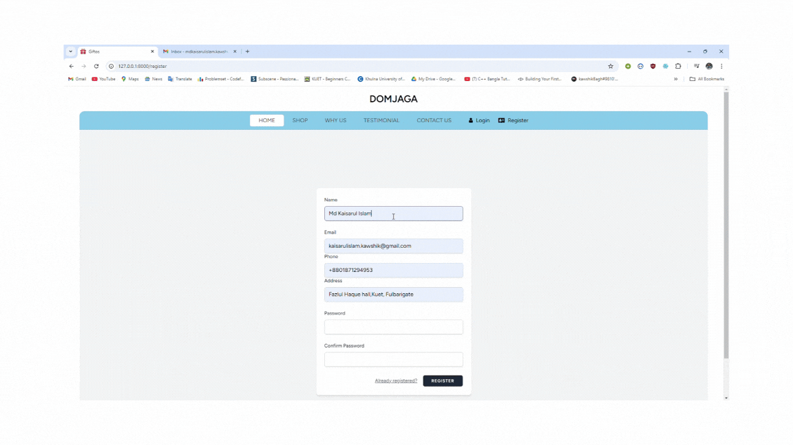
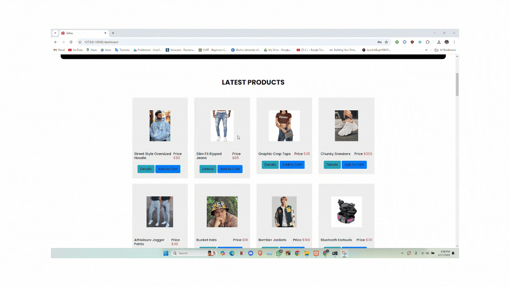
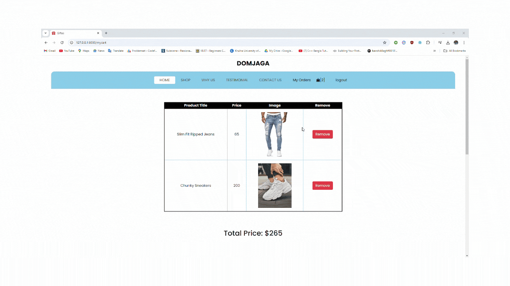
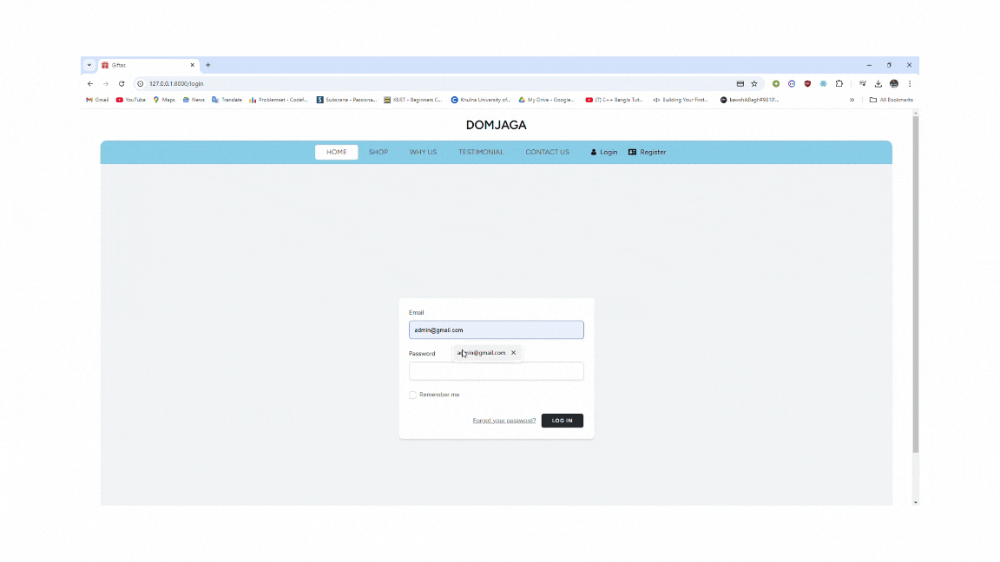
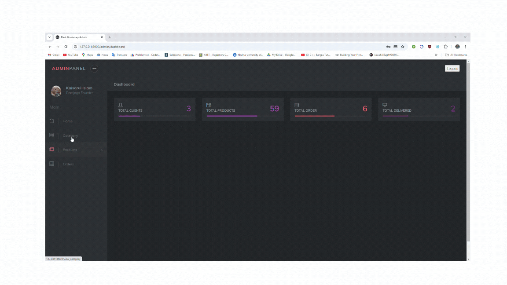
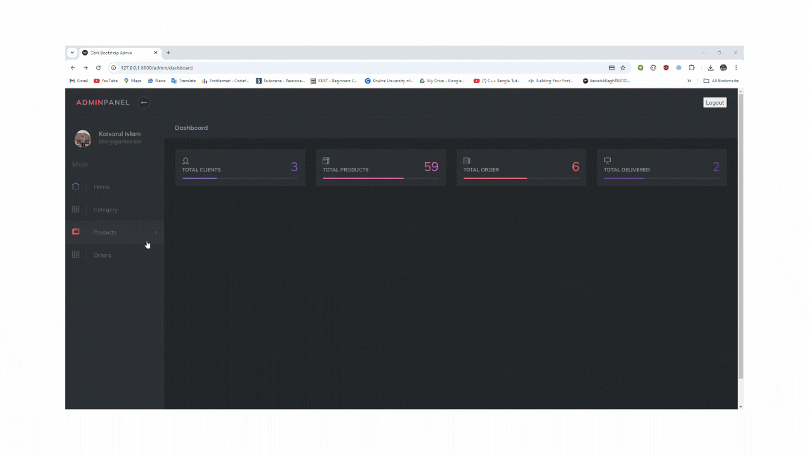
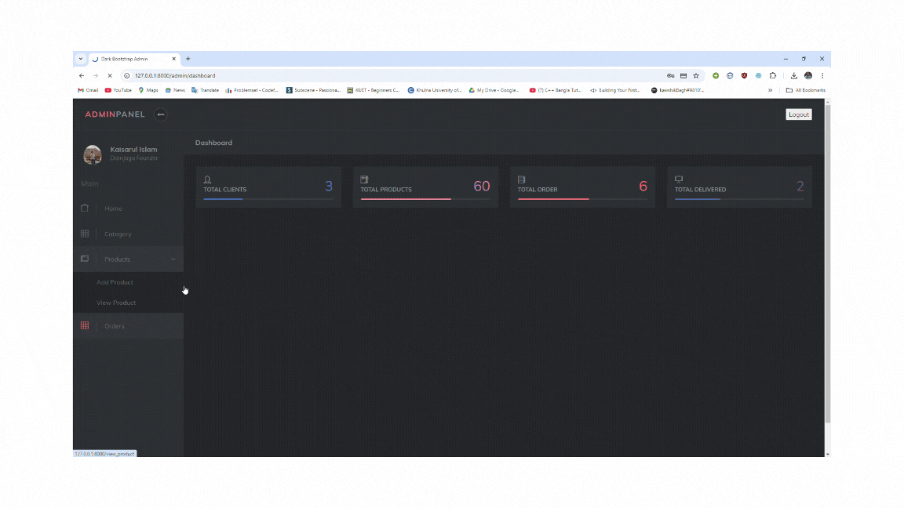

# DomJaga 🛍️  
**Find Your Vibe
Own Your Style!**  
Welcome to **DomJaga**, an e-commerce platform designed to bring trendy fashion, cool gadgets, games, accessories, and more—all in one place. Built for a seamless and engaging shopping experience with a powerful admin panel to manage everything efficiently!

---

## 🌟 Features  

### 🛒 User Features:  
1. **Intuitive UI**: A sleek and modern design for an enjoyable shopping experience.  
2. **Wide Product Range**: Explore categories like fashion, gadgets, games, and more.  
3. **Secure Payments**: Ensuring your transactions are safe and secure.   

### 🛠️ Admin Panel Features:  
1. **Category Management**: Add, edit, and delete categories with ease.  
2. **Product Management**: Quickly add, update, or remove products.  
3. **Order Tracking**: Manage and update order statuses effortlessly.  
4. **User Management**: View and manage user accounts.  
5. **Reports & Analytics**: Gain insights into sales, orders, and user behavior.  

---

## 🚀 How It Works  

### For Users:  
1. Log in to the user account with proper email verification.
2. Browse through a variety of categories tailored for the young generation.    
3. Enjoy seamless checkout with secure payment options.  
4. Track your orders.  

### For Admins:  
1. Log in to the admin panel with secure credentials.  
2. Manage categories, products, and orders with just a few clicks.  
3. Monitor the performance of the store with insightful reports.  

---

## 🎥 Demo  
 

- **Homepage Tour**:

  

- **Sign Up and Verify Email**:

  

- **Product Browsing & Add to Cart**:

  
  
- **Checkout & Payment Process**:

  

- **Admin Panel Overview**:

  
 
- **Adding Categories**:

  

- **Adding Products**:

  

- **Managing Orders**:

  
 

---

## ⚙️ Tech Stack

- **Frontend**: HTML, CSS, JavaScript, Bootstrap
- **Backend**: Laravel 11
- **Database**: MySQL 

--- 

## 📦 Installation & Setup

### Clone the repository:
    ```bash
    git clone https://github.com/yourusername/domjaga.git
    cd domjaga

### Install dependencies:
    ```bash
    composer install
    npm install

### Set up the environment variables:
    Copy .env.example to .env and update configurations

### Run the application:
    ```bash
    php artisan serve
    npm run dev

---

## 📧 Contact Us

If you have any questions, suggestions, or issues, feel free to reach out:

- **Email**: mdkaisarulislam.kawshik@gmail.com
- **Phone**: +8801871294953

---


